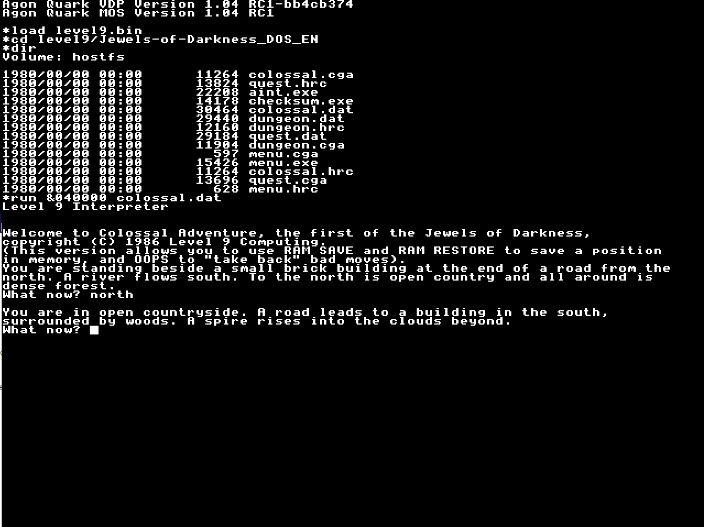

# Level9 Interpreter for Agon Light

Level9 is an interpreter for the games by the English text adventure company Level 9. These games received considerable
critical acclaim at the time and are probably the best text adventures written for the small cassette based 8-bit
computers common in Britain during the early to mid 1980s.

_Please note: This readme is specific to the port of the interpreter to Agon Light computer.<br>_
_**[README-original.md](README-original.md) is the original info from one of the interpreter authors, David Kinder.**_

---
**Table of contents**

- [About](#about)
- [About Agon Light port](#about-agon-light-port)
- [Usage](#usage)
- [Building](#building)
    - [Compilation prerequisites](#compilation-prerequisites)
    - [Making the binary](#making-the-binary)
- [Supported Games](#supported-games)
- [Tested games](#tested-games)
- [Links](#links)
- [License](#license)

**Additional local docs**

- [Original README of one of the authors](README-original.md)

---

# About

The Level9 interpreter was originally written by Glen Summers, and later extended by David Kinder, along with Alan
Staniforth, Simon Baldwin, Dieter Baron and Andreas Scherrer. It has the very useful ability to search for Level 9
game data in any file loaded into it, allowing it to find games in uncompressed memory dumps from emulators (such as
the commonly used Spectrum emulator SNA file format). Both the line-drawn graphics used in a number of Level 9's
earlier games and the bitmap graphics from later games are also supported.

# About Agon Light port

The port of the interpreter to Agon Light is rudimentary at the moment. While all
the code base is fully compiled and all features are supported, platform-specific
implementation uses project's generic code only. This also means no support
for graphics of any form.

The code uses standard MOS terminal, with all editing capabilities. However, backspace
seems to not work well at the moment.

# Usage

The interpreter is available as a simple binary. To run a given game, load the interpreter, switch
to the game directory and run the interpreter while indicating the game DAT file:

```
load level9.bin
cd level9/Jewels-of-Darkness_DOS_EN
run &040000 quest.dat
```

# Building

The game uses continuous memory model and as such would not fit in the 64k
of standard Z80 RAM address space without extra C code optimization. Luckily,
the Agon Light can utilize its eZ80's larger 24-bit address space and its 512k memory.
The game engine takes ~64kB of memory, the rest is available for the loaded game data, heap and stack.

## Compilation prerequisites

The game runs in eZ80 ADL mode and requires C compiler capable of producing such code.
The port was developed using AgDev LLVM compiler targeted for eZ80. Feel free to follow instructions
at [AgDev GitHub page](https://github.com/pcawte/AgDev) to install the suite. It is by itself
an adaptation of the [CE C/C++ Toolchain](https://ce-programming.github.io/toolchain/static/getting-started.html)
originally created for the TI-84 calculator.

_Please note: When placing AgDev on top of CEdev pack, don't try to build the latest version of C/CE++ from
the source, but use the provided downloadable stable distribution. The AgDev placed on top of the latest C/CE++
built from source works just fine, but creates incorrect Agon binaries at the moment (as of Oct 4th, 2023)._

## Making the binary

Agon-specific port `Makefile` is available in `Agon/` directory and if CEdev is installed,
simple `make clean && make` on Linux should produce the desired `dist/level9.bin` MOS binary.

```
cd Agon
make clean
make
```

_Please note: it is essential to run `make clean` as it links generic interpreter sources from the top directory
to the Agon directory for consumption by the LLVM compiler. Unfortunately, the current CE C/C++ Toolkit rules
are very strict and require all source files to be present at the top of compiled tree. The project structure
unfortunately prohibits us to compile from the project top (source files for other platforms would be picked up)._

# Supported Games

All games supported by the project should be working (V1 - V4), but the most of them have not been tested
in this Agon port. The best bet is to aim for DOS-based game distributions of Level 9 games coming in the form
of separate files. The interpreter requires a `*.dat` file to start, but will read other files when needed.
When grabbing files from other platforms, make sure you provide the actual data files to the interpreter,
not the disk or tape media for the given platform.

The interpreter also supports SNA snapshot files from ZX Spectrum as it will scan them for Level 9 structures.
This feature was not tested on Agon Light.

The interpreter does NOT support Spectrum Next ports of the games
available [here](https://github.com/stefanbylund/zxnext_level9/tree/master/compilation). These use specific
format of textures currently not supported by this main-derived code base of Level 9 interpreter.

# Tested games

**Jewel of Darkness DOS**



# Links

## [Level 9 Interpreter](https://github.com/DavidKinder/Level9)

The original repository of the interpreter this port is based on.

## [Level 9 Memorial](http://l9memorial.if-legends.org/html/home.html)

Information about Level 9 Computing and their games.

## [Abandonware Level 9](https://www.myabandonware.com/browse/developer/level-9-computing-ltd-c2)

The original game disks are available in various forms on the internet, but might be a bit harder to find.
This is one of the places with better-organized files for download.

# License

The Level9 interpreter is licensed under the terms of the GNU General Public License version 2 and is copyright (C)
1996-2011 by Glen Summers and contributors. Contributions from David Kinder, Alan Staniforth, Simon Baldwin, Dieter
Baron and Andreas Scherrer.
